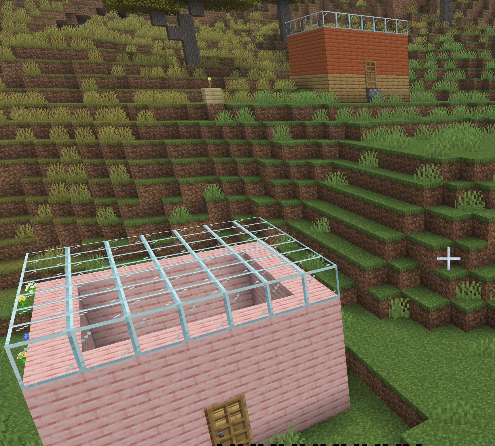
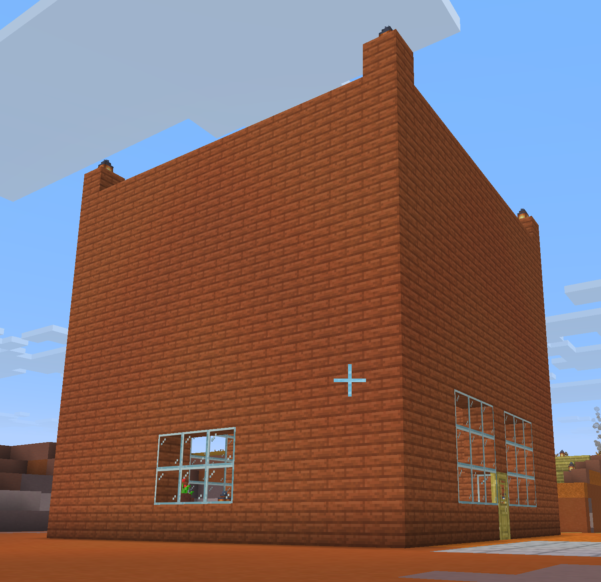

# MyPlugin - Minecraft Bukkit Server Plugin

A feature-rich Bukkit/Spigot plugin for Minecraft 1.20 that provides building utilities, mob spawning, and player management commands.

## Features

### Building Commands
- **`/buildhouse`** - Constructs houses with customizable dimensions and material
- **`/buildhouse2`** - Constructs houses with slanted roof style. Work in progress.
- **`/buildtower`** - Builds vertical towers with specified height and block type
- **`/buildtowersand`** - Specialized tower building with sand blocks. Useful for dropping in the ocean for visual markers
- **`/buildziggurat`** - Builds a ziggurat structure with optional stairs
- **`/generatetree`** - Generates natural-looking trees
- **`/generatecherrytree`** - Generates cherry tree variants
- **`/fillarea`** - Fills flat areas with specified block type
- **`/fillareablock`** - Fills a flat area with specified block type and height. Useful for construction as well as clearing when air is used for material.
- **`/cleararea`** - Clears dirt blocks in a square area
- **`/placeflowers`** - Places flowers around the player
- **`/placerail`** - Places a line of rails in front of the player
- **`/placeitem`** - Places a line of items in front of the player

### Player & World Management
- **`/additem`** - Adds items to player inventory with custom amounts
- **`/move`** - Moves the player forward
- **`/setlevel`** - Set player experience level
- **`/spawnmob`** - Spawn mobs near the player
- **`/explodezone`** - Set up TNT with redstone fuse and lever control

### Menu & Navigation
- **`/buildmenu`** - Opens interactive build menu
- **`/setwarp`** - Create warp points at current location
- **`/warp`** - Teleport to saved warp points
- **`/listwarps`** - List all saved warp points
- **`/zzz`** - Panic command for quick teleport home

## Technical Details

- **Platform:** Bukkit/Spigot
- **Minecraft Version:** 1.20.1
- **Build System:** Gradle
- **Language:** Java

## Building

```bash
gradle build
```

### Deployment

To deploy the plugin to a local Spigot server:

```bash
gradle deployPlugin
```

This task compiles the plugin and copies the JAR to your Spigot server's plugins directory.

## Project Structure

```
src/main/java/com/minecraftplay/
├── MyPlugin.java        # Main plugin class with command handling
```

## Dependencies

- **spigot-api:1.20.1-R0.1-SNAPSHOT** - Official Spigot API for Minecraft 1.20.1

## License

See [LICENSE](LICENSE) file for details.

## Screenshots

Some sample visuals of various commands

### House - from buildhouse



### Big House - from `fillareablock`



### Ziggurat - from `buildziggurat`

