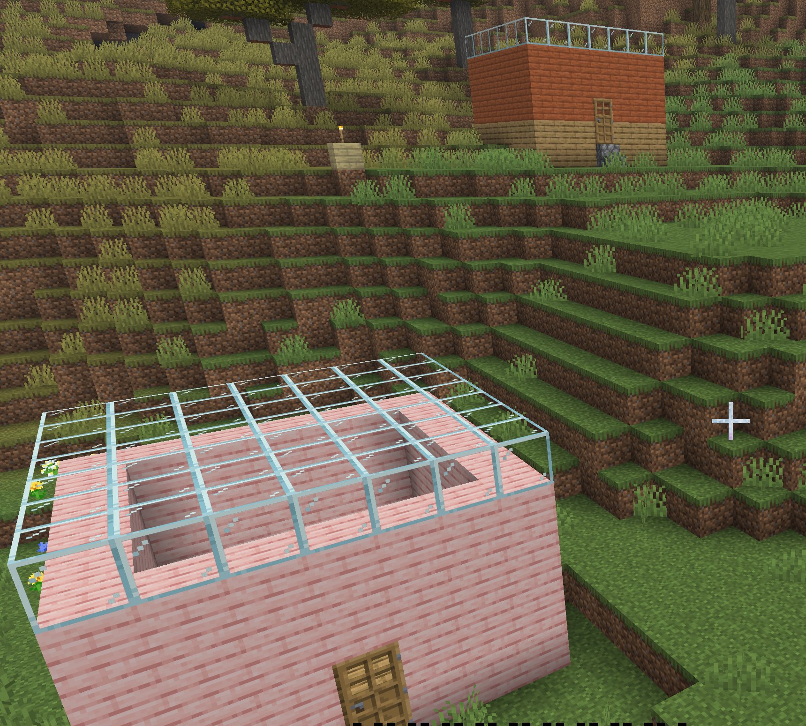
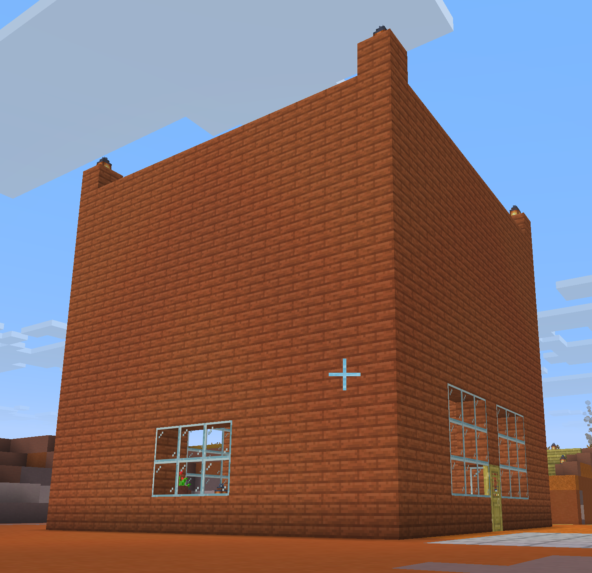
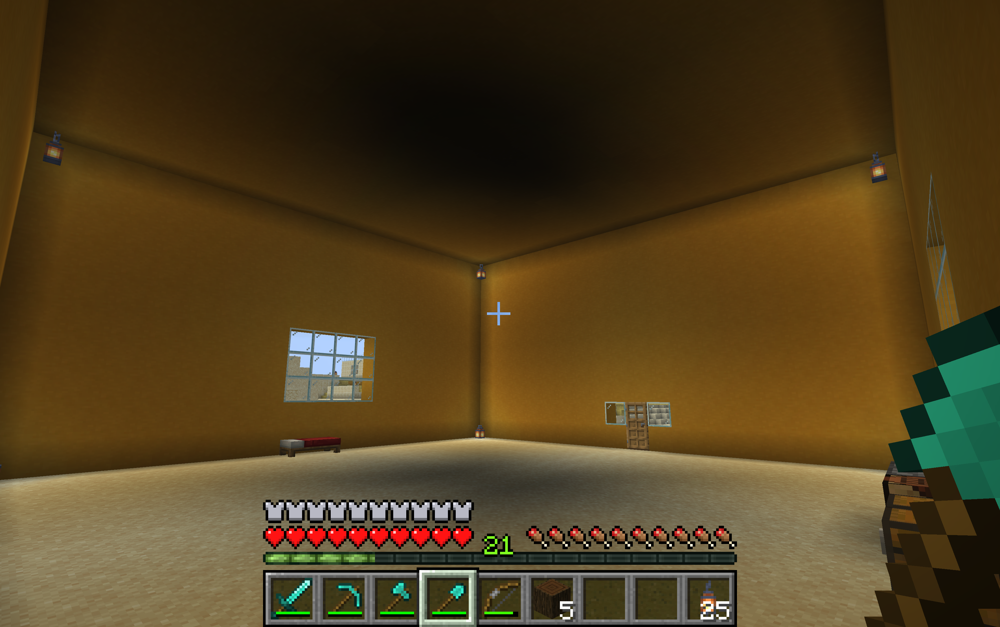
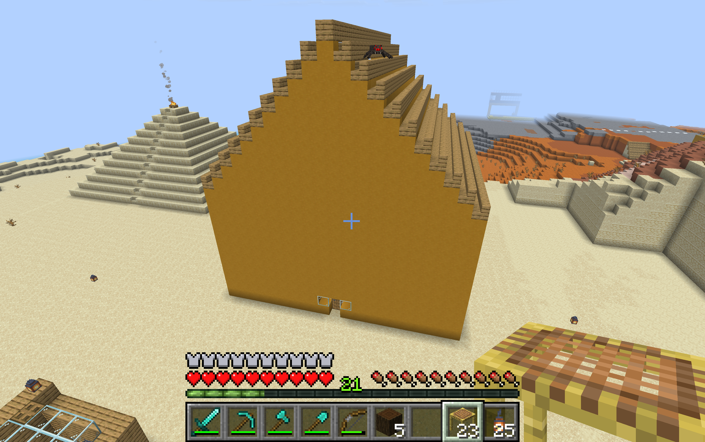
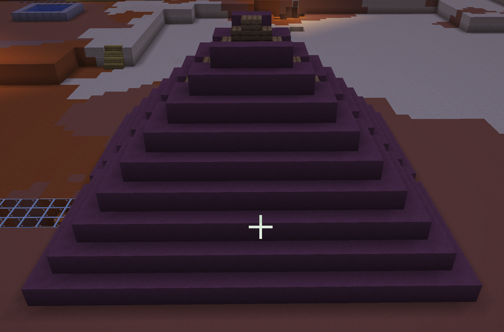
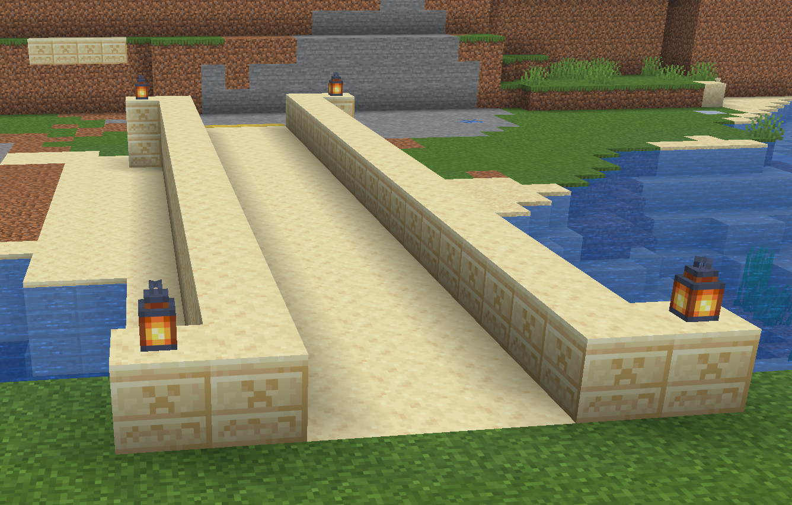

# MyPlugin - Minecraft Bukkit Server Plugin

A feature-rich Bukkit/Spigot plugin for Minecraft 1.20 that provides building utilities, mob spawning, and player management commands.

## Features

## 📋 Command Reference

Below is the complete list of commands available in this plugin, organized by functionality.

### 🏗️ Building & Architectural Commands
Command | Usage | Description
---|---|---
`/buildbuilding` | `/buildbuilding <radius> <height> <peakedRoof> <blockType>` | Builds a hollow structure with customizable dimensions and roof type.
`/buildbuildingrandomstyle` | `/buildbuildingrandomstyle <radius> <height> <peakedRoof> [style]` | Constructs a building with randomized block materials and style variations.
`/buildhouse` | `/buildhouse <length> <width>` | Constructs a standard wooden house at your current location.
`/buildhouse2` | `/buildhouse <length> <width>` | Constructs a wooden house with a slanted roof design.
`/buildtower` | `/buildtower <height> <blockType>` | Builds a vertical tower of specified height and material.
`/buildtowersand` | `/buildtowersand <height>` | Builds a sand tower (useful for dropping into water as ocean markers).
`/buildziggurat` | `/buildziggurat <length> <blockType> <stairs>` | Builds a stepped ziggurat pyramid with optional stair placement.
`/buildbridge` | `/buildbridge <length> <width> <blockType>` | Builds a bridge across gaps or bodies of water.

---

### 🌿 Environment & Terraforming Commands
Command | Usage | Description
---|---|---
`/fillarea` | `/fillarea <radius> <blockType>` | Fills a flat square area around the player with a specified block type.
`/fillareablock` | `/fillarea <radius> <height> <blockType>` | Fills a 3D block volume with height (use `air` for clearing large spaces).
`/cleararea` | `/cleararea` | Clears all dirt blocks in a square area surrounding the player.
`/generatetree` | `/generatetree` | Generates a natural tree structure at your location.
`/generatecherrytree` | `/generatecherrytree` | Generates a cherry tree variant at your location.
`/placeflowers` | `/placeflowers <name> <radius>` | Scatters specified flowers in a radius around the player.
`/placeitem` | `/placeitem <length>` | Places a straight line of items directly in front of the player.
`/placerail` | `/placerail <length>` | Lays down a line of minecart rails in the direction you are facing.
`/streetlamp` | `/streetlamp <height> <blockType>` | Creates a street lamp of optional height and blockType.

---

### 🛠️ Player & World Management
Command | Usage | Description
---|---|---
`/additem` | `/additem <itemName> [amount]` | Adds a specified item and quantity directly to the player's inventory.
`/setlevel` | `/setlevel <level>` | Sets the player's experience level.
`/settime` | `/settime <time>` | Sets the world time of day (e.g., day, night, or tick value).
`/spawnmob` | `/spawnmob <mobType> [amount]` | Spawns a specified entity type and amount near the player.
`/explodezone` | `/explodezone <size>` | Places TNT with a redstone fuse and lever for controlled detonations.

---

### 🧭 Navigation & Utilities
Command | Usage | Description
---|---|---
`/buildmenu` | `/buildmenu` | Opens the interactive build menu GUI.
`/move` | `/move` | Moves the player forward automatically.
`/setwarp` | `/setwarp <name>` | Sets a named warp point at your current position.
`/warp` | `/warp <name>` | Teleports you to a previously saved warp location.
`/listwarps` | `/listwarps` | Displays a list of all saved warp points.
`/zzz` | `/zzz` | Emergency / panic command to instantly warp back home.

## Technical Details

- **Platform:** Bukkit/Spigot
- **Minecraft Version:** 1.20.1
- **Build System:** Gradle
- **Language:** Java

## Building

```bash
gradle build
```

### Deployment

To deploy the plugin to a local Spigot server:

```bash
gradle deployPlugin
```

This task compiles the plugin and copies the JAR to your Spigot server's plugins directory.

## Project Structure

```
src/main/java/com/minecraftplay/
├── MyPlugin.java        # Main plugin class with command handling
```

## Dependencies

- **spigot-api:1.20.1-R0.1-SNAPSHOT** - Official Spigot API for Minecraft 1.20.1

## License

See [LICENSE](LICENSE) file for details.

## Screenshots

Some sample visuals of various commands

### House - from buildhouse



### Big House - from `fillareablock`



### Big Building - from `buildbuilding`





### Ziggurat - from `buildziggurat`



### Bridge - from `buildbridge`

